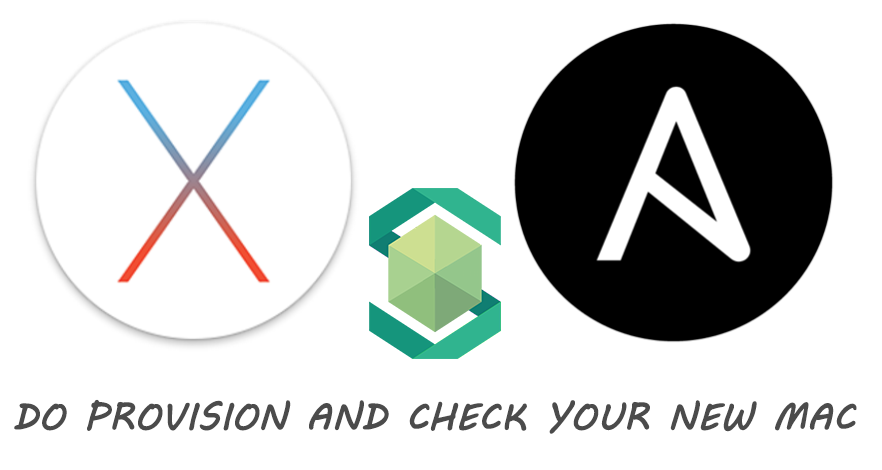

# Mac Automation Environment Setup Tool

[](LICENSE)
[](https://github.com/RichardLitt/standard-readme)
[](https://dev.azure.com/meitantei-conan/mac-auto-setup/_build/latest?definitionId=2&branchName=master)



> Automation Env Setup tool for Mac

Automation Environment setup tool for Mac using by Ansible provisioning and Serverspec checks.

## Table of Contents

- [Background](#background)
- [Install](#install)
- [Usage](#usage)
- [License](#license)

## Background

One day, every time I replaced my PC, I was getting tired of building my own familiar and useful PC environment.

So that, I created an automatic environment setup tool for Mac with Ansible.


## Install

### System Requirements

- XCode
- Homebrew
- Ansible
- Ruby `v2.4.0 and more`

### Preconditions

This tool used by Homebrew, Ansible and Serverspec.

So, Install those apps before run this tool.

#### Install XCode and Homebrew

```
# Install XCode
$ xcode-select --install

# Install Homebrew
$ /usr/bin/ruby -e "$(curl -fsSL https://raw.githubusercontent.com/Homebrew/install/master/install)"

# Homebrew doctor: If error, Search by Google!
$ brew doctor
```

#### Install Ansible

```
# Install Ansible
$ brew install ansible
```

#### Git User Config

And also, Set `Git config` with 2 files.

- Your name: git user name with commits
- Your Email: git user email with commits

ansible/mac/roles/dev-tools/vars/main.yml
```
---
git:
  name: "Your name"
  mail: "Your Email"
```

serverspec/mac/variables.yml
```
  git_conf:
    - Your name
    - Your Email
```

## Usage

```
# Setup your Mac with Ansible
make setup TARGET=mac

# Check your Mac with Serverspec
make before-check TARGET=mac
make check TARGET=mac
```

## CI

This repo is integrated with [Azure Develop Pipeline](https://dev.azure.com/meitantei-conan/mac-auto-setup/_build?definitionId=2&_a=summary).

Run the Ansible playbook and the Serverspec on MacOSX Mojave.

The badge below shows **Build Status**.

[](https://dev.azure.com/meitantei-conan/mac-auto-setup/_build/latest?definitionId=2&branchName=master)

## Technically Tips

### Ansible

Server provisioning automation tool. The image used in SSH is strong, but there is also a function called `local Exec`.

It also supports Mac Homebrew.

### Serverspec

Server automated test tools using by Ruby run a pre-prepared test script to check if the server is configured to meet the desired requirements.

You can check the command output and installation status.

## License

[MIT © tubone24](LICENSE)
